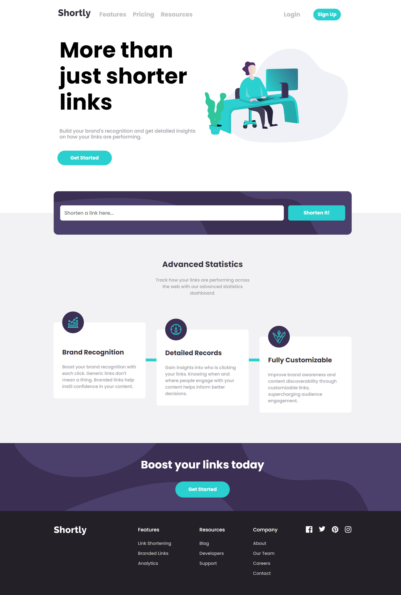

# Frontend Mentor - Shortly URL shortening API Challenge solution

This is a solution to the [Shortly URL shortening API Challenge challenge on Frontend Mentor](https://www.frontendmentor.io/challenges/url-shortening-api-landing-page-2ce3ob-G). Frontend Mentor challenges help you improve your coding skills by building realistic projects. 

## Table of contents

- [Overview](#overview)
  - [The challenge](#the-challenge)
  - [Screenshot](#screenshot)
  - [Links](#links)
- [My process](#my-process)
  - [Built with](#built-with)
  - [What I learned](#what-i-learned)
  - [Continued development](#continued-development)
  - [Useful resources](#useful-resources)
- [Author](#author)
- [Acknowledgments](#acknowledgments)

## Overview

### The challenge

Users should be able to:

- View the optimal layout for the site depending on their device's screen size
- Shorten any valid URL
- See a list of their shortened links, even after refreshing the browser
- Copy the shortened link to their clipboard in a single click
- Receive an error message when the `form` is submitted if:
  - The `input` field is empty

### Screenshot



### Links

- Solution URL: [https://github.com/victor247k/UrlShortener]
- Live Site URL: [https://victor247k.github.io/UrlShortener/]

## My process

### Built with

- Semantic HTML5 markup
- CSS custom properties
- Flexbox
- CSS Grid
- Mobile-first workflow
- CSS Responsive
- JS
- README.md file

### What I learned

I learned about &apos and other & signs in html, how to copy something to clipboard by pressing a button, and I practiced styling, making a aresponsive design and effective html.

```html
&apos
```
```css
header:nth-child(2):focus, header:focus-within > nav, header {
  height: auto;
  transform: scale(1);
}
```
```js
navigator.clipboard.writeText("Hello World");
```

### Continued development

For the future, I want to practice using APIs more, get better at JS, learn to use a framework like react, tailwind, angular or vue.

### Useful resources

- [Example resource 1](https://www.w3schools.com/howto/howto_js_copy_clipboard.asp) - This helped me how to copy something to clipboard by pressing a button. In general this w3s site is very useful for any programing languege that is has I recomend it to anyone starting learning a new languege.

## Author

- Frontend Mentor - [@yourusername](https://www.frontendmentor.io/profile/victor247k)
- Instagram - [@victorspinei247](https://www.instagram.com/victorspinei247/)
- Bio Link - [dose.lol/victor](https://dose.lol/victor)

## Acknowledgments

I am thankful for this challenge, practiced using APIs and learned how to copy something to the clipboard using js.